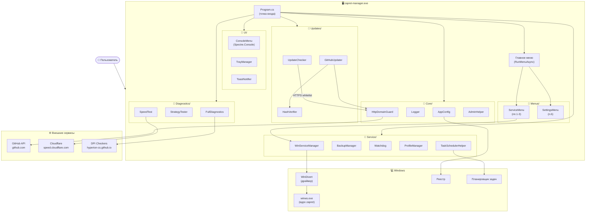

# Zapret Manager

<div align="center">

[](https://github.com/WildeSR98/12345/actions/workflows/ci.yml)
[](https://github.com/WildeSR98/12345/releases/latest)
[](https://github.com/WildeSR98/12345/releases)
[](https://dotnet.microsoft.com/download/dotnet/8.0)
[](https://www.microsoft.com/windows)
[](LICENSE)

**Менеджер для обхода блокировок Discord, YouTube и других сайтов на Windows**

</div>

> **Важно**: Discord работает, а YouTube — нет? Включите **Secure DNS** в браузере:
> - **Chrome/Edge**: Настройки → Конфиденциальность → Безопасность → Использовать безопасный DNS → Google
> - **Firefox**: Настройки → Параметры сети → DNS через HTTPS → Максимальная защита → Google

---

## 📥 Скачать

Перейдите на страницу [Releases](https://github.com/WildeSR98/12345/releases) и скачайте один из архивов:

| Архив | Размер | Описание |
|-------|--------|----------|
| `zapret-manager-v*-standalone.zip` | ~84 MB | **Рекомендуется.** Работает из коробки, не требует .NET |
| `zapret-manager-v*-net8-required.zip` | ~21 MB | Лёгкий, требует [.NET 8 Runtime](https://dotnet.microsoft.com/download/dotnet/8.0) |

---

## 🚀 Быстрый старт

```
1. Распакуйте архив в любую папку (например, C:\zapret\)
2. Запустите zapret-manager.exe от имени администратора
3. Следуйте подсказкам — менеджер сам всё настроит
```

> Папку можно перемещать — менеджер работает из любого расположения.

---

## 🗺 Архитектура



---

## 🖥 Системный трей

При запуске автоматически появляется иконка в трее (рядом с часами):
- 🟢 — служба запущена
- 🟡 — служба остановлена
- 🔴 — служба не установлена

**Правый клик по иконке:**
- Статус службы и текущая стратегия
- Переключить стратегию (без открытия консоли)
- Перезапустить / Остановить службу
- Открыть консоль → полное меню
- Выход

> Трей работает как отдельный процесс — закрытие консоли не убивает его.

---

## 🏠 Главное меню

```
  ════════════════════════ Zapret Manager v2.5.x ════════════════════════
    Manager   v2.5.0          Core  2024-12-01
    Служба    запущена         Стратегия  general_ALT
    ────────────────────────────────────────────────────────────────────
    :: СЛУЖБА
       1.  Установить службу      (Spectre SelectionPrompt)
       2.  Удалить службы
       3.  Проверить статус       (rich table)
    :: НАСТРОЙКИ
       4.  Игровой фильтр         [выкл]
       5.  IPSet фильтр           [loaded]
       6.  Обновления             [вкл | авто]
    ...
    :: СЕРВИС (пп.14-23 — расширенные функции)
       17. Watchdog (авторотация) [выкл]
       18. Speed-тест
       19. Редактор стратегий
       20. Определение провайдера
       ...
```

---

## 🔧 Сервисное меню (полная таблица)

| № | Что делает |
|---|-----------|
| 1 | Установить службу — SelectionPrompt выбора стратегии |
| 2 | Удалить все службы zapret |
| 3 | Статус служб (rich Spectre Table) |
| 4 | Игровой фильтр TCP/UDP |
| 5 | Переключение IPSet (loaded / none / any) |
| 6 | Настройки обновлений + задача планировщика |
| 7 | Обновить список IPSet |
| 8 | Обновить файл Hosts |
| 9 | Проверить обновления (Manager + Core) |
| 10 | Диагностика доступности сайтов |
| 11 | Тест стратегий и установка лучшей |
| 12 | Экспорт системного отчёта |
| 13 | TG WS Proxy (управление прокси для Telegram) |
| 14 | Бэкап / Восстановление конфигурации |
| 15 | Профили настроек |
| 16 | Мониторинг трафика (live rx/tx) |
| 17 | Watchdog — авторотация стратегий при сбоях |
| 18 | Speed-тест (Cloudflare) |
| 19 | Редактор стратегий |
| 20 | Определение провайдера ISP |
| 21 | Управление доменами (whitelist/blacklist) |
| 22 | Выбор сетевого адаптера |
| 23 | Экспорт/Импорт всех настроек (ZIP) |

---

## 🧪 Тестирование стратегий

Доступно при установке и через пункт **[11]**:

```
[1/19] general (ALT).bat
──────────────────────────────────────────────────────────
  Discord Main        HTTP:OK    TLS1.2:OK    TLS1.3:OK    | Ping: 42 ms
  YouTube Web         HTTP:OK    TLS1.2:OK    TLS1.3:UNSUP | Ping: 38 ms
```

### DPI тест (провайдер)
```
  [🇷🇺]MTS       HTTP:OK    TLS1.2:BLOCK TLS1.3:OK    ⚠ 16-20KB freeze
```

---

## 🔐 Безопасность

- **SHA256 верификация** — все скачиваемые архивы проверяются по хешам перед распаковкой
- **Domain whitelist** — HTTP-запросы разрешены только к `github.com`, `raw.githubusercontent.com`, `speed.cloudflare.com` и партнёрам
- **Требование UAC** — менеджер всегда запускается с проверкой прав администратора

---

## ❓ Частые вопросы

### YouTube не работает после установки
1. **п.10 (Диагностика)** — посмотрите что не работает
2. Включите **Secure DNS** в браузере
3. **п.11 (Тест стратегий)** — найдёт рабочую стратегию

### Лагают онлайн-игры
Включите **п.4 (Игровой фильтр)** — обход работает только для нужных сайтов.

### Перестало работать через время
1. **п.9** — проверьте обновления
2. **п.7** — обновите IPSet
3. **п.11** — протестируйте стратегии
4. **п.17** — включите Watchdog

### Как полностью удалить?
1. **п.2 (Удалить службы)**
2. Удалите папку с программой

---

## ⚙️ Для продвинутых

### CLI-аргументы

```
zapret-manager.exe                         — мастер установки (по умолчанию)
zapret-manager.exe --menu                  — сервисное меню (23 пункта)
zapret-manager.exe --tray                  — только трей (фоновый режим)
zapret-manager.exe --remove               — удаление служб
zapret-manager.exe --reinstall            — переустановка
zapret-manager.exe --test                 — тест стратегий
zapret-manager.exe --diagnostics          — диагностика + экспорт отчёта
zapret-manager.exe --check-updates        — тихая проверка обновлений (для Task Scheduler)
zapret-manager.exe --silent --strategy "FAKE TLS AUTO"  — тихая установка
```

### Структура папок

```
📁 publish/                ← Основная папка
│  zapret-manager.exe      ← Менеджер
│  config.json             ← Настройки (AppConfig)
│  CHANGELOG.md            ← История версий
│
├─ bin/                    ← Ядро zapret (winws.exe + WinDivert)
├─ strategies/             ← Стратегии обхода (*.bat)
├─ lists/                  ← Списки доменов и IP (ipset-all.txt, ...)
├─ utils/                  ← Служебные флаги и состояние
├─ profiles/               ← Профили настроек
├─ logs/                   ← Логи (авторотация 14 дней)
└─ backups/                ← Резервные копии (keepCount настраивается)
```

### Сборка из исходников

```bash
# Требуется .NET 8 SDK

# Standalone (не требует .NET Runtime у пользователя, ~84 MB)
dotnet publish src/ZapretManager/ZapretManager.csproj \
  -c Release -r win-x64 --self-contained true \
  -p:PublishSingleFile=true -o publish-standalone

# Требует .NET 8 Runtime (~21 MB)
dotnet publish src/ZapretManager/ZapretManager.csproj \
  -c Release -r win-x64 --self-contained false \
  -p:PublishSingleFile=true -o publish-net8

# Запуск тестов
dotnet test src/ZapretManager.Tests/
```

---

## 📄 Благодарности

- [zapret](https://github.com/bol-van/zapret) — ядро обхода DPI
- [zapret-discord-youtube](https://github.com/Flowseal/zapret-discord-youtube) — стратегии и списки
- [dpi-checkers](https://github.com/hyperion-cs/dpi-checkers) — тесты DPI блокировок
- [Spectre.Console](https://spectreconsole.net/) — богатый консольный UI

## ⚠️ Дисклеймер

Программа предоставляется «как есть» для образовательных целей. Используйте на свой страх и риск.
